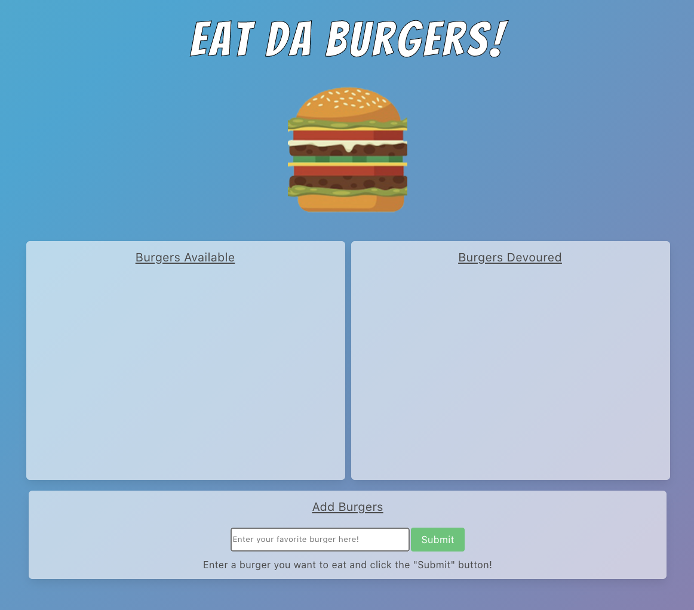
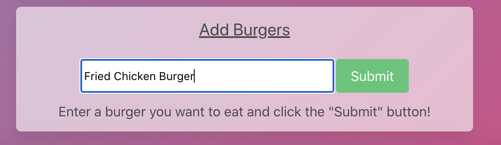
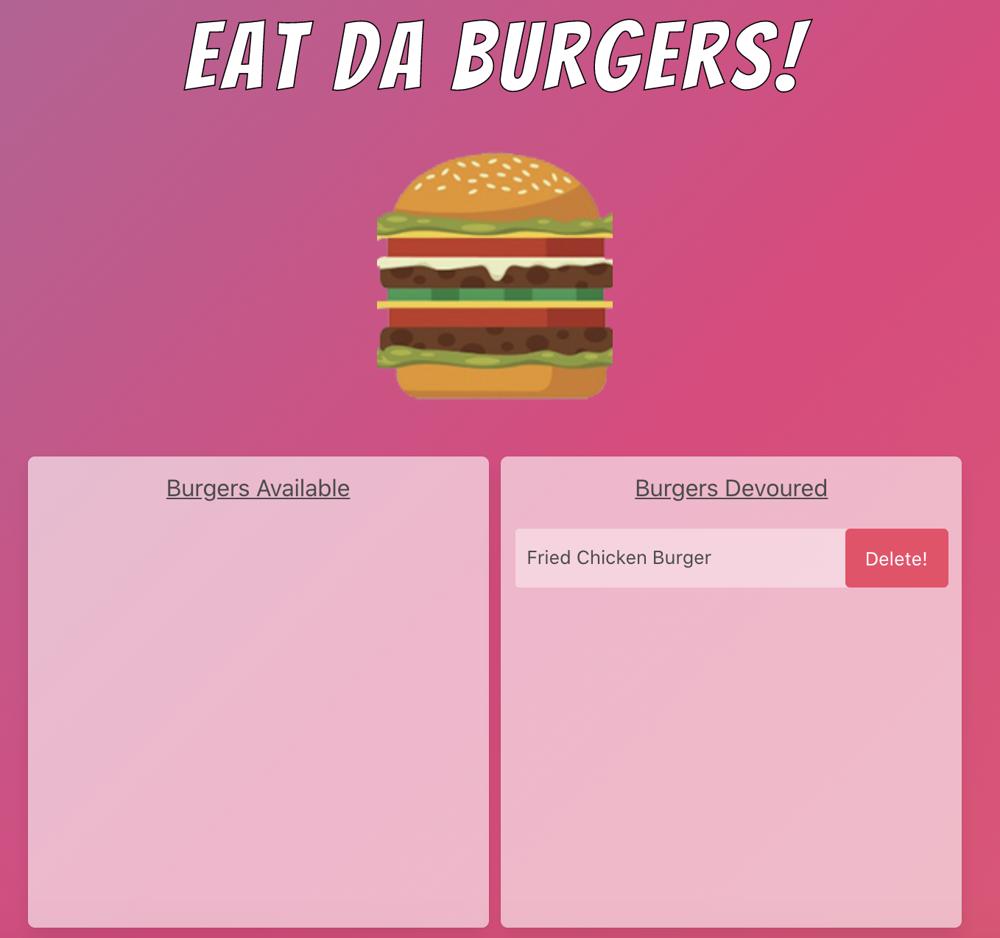

# EAT-DA-BURGER

## Table of Contents

- [Description](#description)
- [Technologies used](#technologies-used)
- [How to Install Dependencies](#how-to-install-dependencies)
- [Usage](#usage)
- [License](#license)
- [Contributoring](#contributing)
- [Tests](#tests)
- [Questions](#questions)

## Description

I have created a burger logger utilizing the power of MySQL, Node, Express, Handlebars and a homemade ORM. This application has followed the MVC design pattern, using Node and MySQL to query and route data in the app, and Handlebars to generate the HTML file.

Please find the deployed application from here deloyed on Heroku:
https://pacific-castle-30838.herokuapp.com/

## Technologies used

- JavaScript
- Handlebars.js
- Node
- Express
- MySQL
- ORM
- HTML
- CSS
- [Bulma CSS](https://bulma.io/)
- npm packages

## How to install dependencies

Please use: npm i

## Usage

Screenshot 1: this is the UI the user would see once the application is up running.

---

Screenshot 2: The user gets to input the name of his/her favorite burger and hit submit!

---

Screenshot 3: Once the submit button is hit, the burger is now available. Every available burger now has the "devoured" button.

---

Screenshot 4: the devoured button takes the burger to the "burgers devoured" section. the user can delete the burger if he/she wishes to do so.

## License

MIT

## Contributing

Pull requests are welcome. For major changes, please open an issue first to discuss what you would like to change. Also, please make sure to update tests as appropriate.

## Questions

[Email Me!](mailto:nishii.dev.syd@gmail.com)

[Link to my GitHub](https://github.com/noriyuki-ishii-820)
